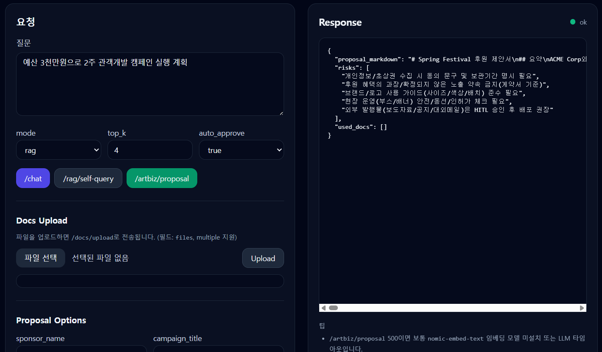

# LangChain Catalog Lab (Docker + Python)
 
LangChain의 기능을 **“카탈로그(기능별 독립 데모)”** 형태로 최대한 촘촘하게 정리한 학습 레포입니다.  
각 데모는 **단독 실행 가능**하며, 동일한 `LLM Factory`를 통해 **Ollama / OpenAI-호환 / OpenAI**를 스위칭할 수 있습니다.

- ✅ Docker 한 번으로 실행
- ✅ LCEL(Runnable) 중심 (LangChain의 “조합 언어”)
- ✅ Prompts / Output Parsers / Structured Output / Streaming
- ✅ Tools / Tool calling / Agents (ReAct 등)
- ✅ Retrievers / VectorStores / Loaders / RAG 고급 패턴
- ✅ Memory / History / Summarization / Windowing
- ✅ Router / Multi-prompt / JSON mode / Guardrails (실습 관점)
- ✅ SQL / CSV / Web 요청(안전한 범위) 유틸
- ✅ Callbacks / Tracing (옵션 LangSmith)
- ✅ Eval (미니) + 회귀 테스트 샘플

> ⚠️ 일부 기능은 모델 백엔드(예: Ollama vs OpenAI-호환)에 따라 “지원 방식/결과”가 다릅니다.  
> 각 데모 파일 상단에 호환성 노트를 적어두었습니다.

---

## 0) 실행

```bash
cp .env.example .env
docker compose up --build
```
---
```
docker compose down -v
docker compose build --no-cache
docker compose up
```

---


---

개별 데모 실행:

```bash
docker compose run --rm lab python catalog/prompts/01_prompt_templates.py
docker compose run --rm lab python catalog/lcel/03_parallel_and_assign.py
docker compose run --rm lab python catalog/tools/02_tool_calling_bind_tools.py
docker compose run --rm lab python catalog/rag/04_multiquery_compression.py
```

또는 `make demo`:

```bash
make demo D=catalog/agents/02_react_agent.py
```

---

## 1) LLM 연결 (기존 Docker LLM 우선)

### Ollama(권장)
```env
LLM_PROVIDER=auto
OLLAMA_BASE_URL=http://host.docker.internal:11434
OLLAMA_MODEL=llama3.1:8b
OLLAMA_EMBED_MODEL=nomic-embed-text
```

### OpenAI-호환 (LM Studio / vLLM 등)
```env
LLM_PROVIDER=openai_compatible
OPENAI_COMPAT_BASE_URL=http://host.docker.internal:1234/v1
OPENAI_COMPAT_API_KEY=lm-studio
OPENAI_COMPAT_MODEL=gpt-4o-mini
```

### OpenAI
```env
LLM_PROVIDER=openai
OPENAI_API_KEY=YOUR_KEY
OPENAI_MODEL=gpt-4o-mini
```

---

## 2) 카탈로그 인덱스

- `catalog/prompts/*` : PromptTemplate / ChatPromptTemplate / Few-shot / Partial / Messages
- `catalog/lcel/*` : RunnableLambda / Passthrough / Parallel / Assign / Retry / Fallback / Batch / Stream
- `catalog/output/*` : StrOutputParser / JsonOutputParser / PydanticOutputParser / FixingParser
- `catalog/structured/*` : with_structured_output (Pydantic) / list schema / strict json
- `catalog/memory/*` : File history / window memory / summarization memory
- `catalog/tools/*` : @tool / bind_tools / tool schemas / tool-result patterns
- `catalog/agents/*` : ReAct agent / tool agent / 안전한 설계 팁
- `catalog/rag/*` : loaders / splitters / vectorstores / retrievers / RAG patterns
- `catalog/routers/*` : route classification / multi-prompt routing / conditional chains
- `catalog/sql/*` : create_sql_query_chain / SQLite example / 결과 요약
- `catalog/callbacks/*` : callback handler / timing / logging / tracing flags
- `catalog/eval/*` : mini judge / regression set runner
- `data/docs/*` : RAG 데모용 문서 위치
- `storage/*` : 벡터DB / chat history / 샘플 DB

---

## 3) 추천 학습 순서(카탈로그형)

1) prompts → 2) lcel → 3) output/structured → 4) tools → 5) agents → 6) rag → 7) routers → 8) memory → 9) sql → 10) callbacks/eval

---

## 4) v2 추가 카탈로그 (확장팩)

### LangGraph (워크플로우/상태 머신)
- `catalog/langgraph/01_minimal_graph.py`
- `catalog/langgraph/02_agentic_loop_graph.py`
- `catalog/langgraph/03_guarded_graph.py`

> 참고: LangGraph 카탈로그는 실행 시 mermaid 그래프를 콘솔에 출력하고,
> `.mmd` 파일을 `/app/storage/langgraph/` 아래에 저장합니다.

### VectorStore / Retriever 비교
- `catalog/rag/05_vectorstore_compare_notes.md`
- `catalog/rag/06_retriever_mmr.py`
- `catalog/rag/07_self_query_retriever_note.md` *(백엔드/메타데이터 설계에 따라 적용)*

### Guardrails 패턴(실습 관점)
- `catalog/guardrails/01_schema_guard.py`
- `catalog/guardrails/02_context_only_rag_guard.py`
- `catalog/guardrails/03_policy_checks.py`

### Caching / Tool Result 패턴
- `catalog/perf/01_llm_cache_sqlite.py`
- `catalog/tools/03_tool_result_patterns.py`

> 주의: 일부 데모는 설치/환경에 따라 선택적으로 동작하도록 설계되어 있습니다(설명 포함).

---

## 5) v3 추가 카탈로그 (FAISS/자기질의/고급 LangGraph)

### RAG 확장: FAISS / BM25 / Ensemble / Self-Query
- `catalog/rag/08_vectorstore_faiss.py`
- `catalog/rag/09_retriever_bm25.py`
- `catalog/rag/10_ensemble_retriever.py`
- `catalog/rag/11_self_query_retriever.py`

### LangGraph 확장: Checkpoint / Subgraph / Multi-role synthesis
- `catalog/langgraph/04_checkpoint_sqlite.py`
- `catalog/langgraph/05_subgraph_pattern.py`
- `catalog/langgraph/06_multi_role_agents.py`

### Guardrails 확장: Citation required
- `catalog/guardrails/04_citation_required_guard.py`

### Perf 확장: batch vs single
- `catalog/perf/02_batch_vs_single.py`

---

## 6) v4 추가 카탈로그 (안전한 에이전트/툴 + RAG 회귀평가)

### Safe Agent 패턴(라우터→툴 실행→검증→최종 응답)
- `catalog/agents/03_safe_tool_router.py`

### Tool 결과 검증(스키마)
- `catalog/tools/04_tool_result_validator.py`

### LangGraph HITL 승인 패턴(비대화형 환경 지원)
- `catalog/langgraph/07_hitl_approval.py`
  - `.env`에서 `AUTO_APPROVE`, `APPROVE_TOKEN`로 승인 흐름 실습

### RAG 회귀평가 자동화(golden set)
- `data/eval/golden.jsonl`
- `catalog/eval/03_rag_regression.py` → `/app/storage/eval_rag_report.json` 저장

---

## 7) v5 추가 카탈로그 (LLM Judge / 정책 분류기 / 실제 HITL 입력)

### LLM-as-a-Judge 평가(grounding)
- `catalog/eval/04_llm_judge_grounding.py` → `/app/storage/eval_llm_judge_report.json`

### Eval Suite Runner(합본)
- `catalog/eval/05_eval_suite_runner.py` → `/app/storage/eval_suite_report.json`

### LLM 정책 분류기(Structured Classifier)
- `catalog/guardrails/05_policy_classifier_llm.py`

### HITL 실제 입력(터미널 승인 대기)
- `catalog/langgraph/08_hitl_cli_pause.py`
  - TTY 실행 예: `docker compose run --rm -it lab python catalog/langgraph/08_hitl_cli_pause.py`

---

## 8) v6 End-to-End ArtBiz App (FastAPI + HITL + RAG)

이 레포는 카탈로그 데모뿐 아니라, 예술경영전문가 AI를 위한 **엔드투엔드 템플릿 앱**도 포함합니다.

### 실행 (API 서버)
```bash
cp .env.example .env
docker compose up --build api
```

- 웹 UI: `http://localhost:8000/`
- Swagger: `http://localhost:8000/docs`

자세한 설명: `docs/E2E_APP.md`

### CLI 실행
```bash
docker compose run --rm lab python -m app.cli "관객개발 KPI 3개 제안" --mode rag
docker compose run --rm lab python -m app.cli "예산 3천만원 2주 실행계획" --mode plan
```

---

## 9) v7 ArtBiz Domain Tools API

FastAPI에 `/tools/*` 엔드포인트가 추가되었습니다.

- `POST /tools/budget-split`
- `POST /tools/timeline`
- `POST /tools/sponsorship-package`
- `POST /tools/report`

문서: `docs/TOOLS_API.md`

### 실행
```bash
cp .env.example .env
docker compose up --build api
```

---

## 10) v8 Document Upload + Self-Query + Proposal Generator + Tool Eval

### 실행
```bash
cp .env.example .env
docker compose up --build api
```

- 웹 UI: `http://localhost:8000/`
- Swagger: `http://localhost:8000/docs`

### 문서 업로드
- `POST /docs/upload` (pdf/md/txt)

### Self-Query RAG
- `POST /rag/self-query`

### 후원 제안서 생성
- `POST /artbiz/proposal`

### 평가(전체)
```bash
docker compose run --rm lab python catalog/eval/05_eval_suite_runner.py
```

자세한 설명: `docs/V8_FEATURES.md`

---

## 10) v9 운영형 확장 (Metadata 추출 / Self-Query 파싱 노출 / Proposal HITL)

- 업로드 메타데이터 추출: `POST /docs/upload`
- Self-Query 파싱/필터 확인: `POST /rag/self-query`
- 후원 제안서 생성(+승인): `POST /artbiz/proposal`

문서: `docs/V9_FEATURES.md`

---

## 11) v10 운영 모드 (Reindex Queue / Proposal 저장(MD/PDF) / Citation Eval)

### 재인덱싱 큐
- `POST /ops/queue-reindex` (mode: full|incremental)
- 워커: `catalog/ops/01_index_worker.py`

### 제안서 저장(버전)
- `/artbiz/proposal`에 `save=true` 옵션
- 목록: `GET /artbiz/proposals`

문서: `docs/V10_FEATURES.md`

---

## 12) v11 (PDF 개선 + Proposal 메타/승인 기록)

- PDF: Markdown 스타일 렌더링(헤딩/리스트/테이블)
- Proposal 버전 메타: tags/template_version/status/approved_by/approved_at
- 승인 시 버전 승인 기록 반영

문서: `docs/V11_FEATURES.md`

---

## 13) v12 (출판 품질 PDF + 한글 폰트 옵션)

- PDF: 커버/목차/헤더·푸터/표 스타일 고정
- 한글 폰트: `assets/fonts/*.ttf` 또는 `.env`(ARTBIZ_FONT_*)로 제공 시 자동 등록

문서: `docs/V12_FEATURES.md`

---

## 14) v13 (고정형 제안서 템플릿 + 자동 정규화 + 구조 Eval)

- 템플릿: `GET /artbiz/proposal/template`
- 구조 체크: `POST /artbiz/proposal/check`
- proposal 생성 기본값: `normalize=true` (10개 섹션/필수 표/근거 섹션 고정)
- Eval: `catalog/eval/08_structure_compliance.py`

문서: `docs/V13_FEATURES.md`

---

## 15) v14 (섹션별 LLM 리라이트 + TOOL_DATA 결정론 매핑 + 일관성 리포트)

- 기본 모드: `rewrite_mode=llm_sections`
- 표/숫자: TOOL_DATA로 코드가 생성(추측 방지)
- 응답: `consistency_report` 포함

문서: `docs/V14_FEATURES.md`

---

## 16) v15 (섹션별 인용 각주 + 인용 위치/빈도 Eval)

- 섹션별 `SOURCE 1/2` 마커 보정(footnote-like)
- 응답: `citation_enforce_report`, `citation_placement_report`
- Eval: `catalog/eval/10_citation_placement.py`

문서: `docs/V15_FEATURES.md`

---

## 17) v16 ([1][2] 각주 + 부록 매핑 + Eval 11)

- 본문: SOURCE 1/2 → [1]/[2]로 통일
- 부록: [1]/[2]에 실제 스니펫 매핑 자동 삽입
- Eval: `catalog/eval/11_footnote_mapping.py`

문서: `docs/V16_FEATURES.md`
